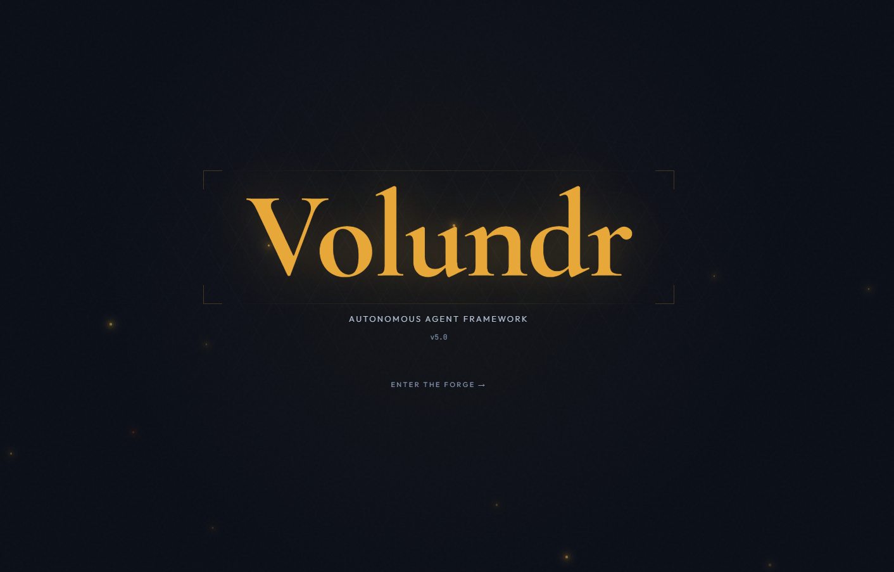
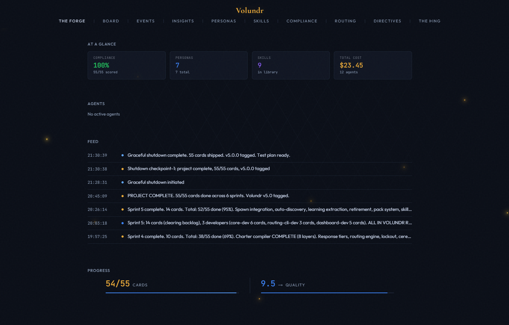
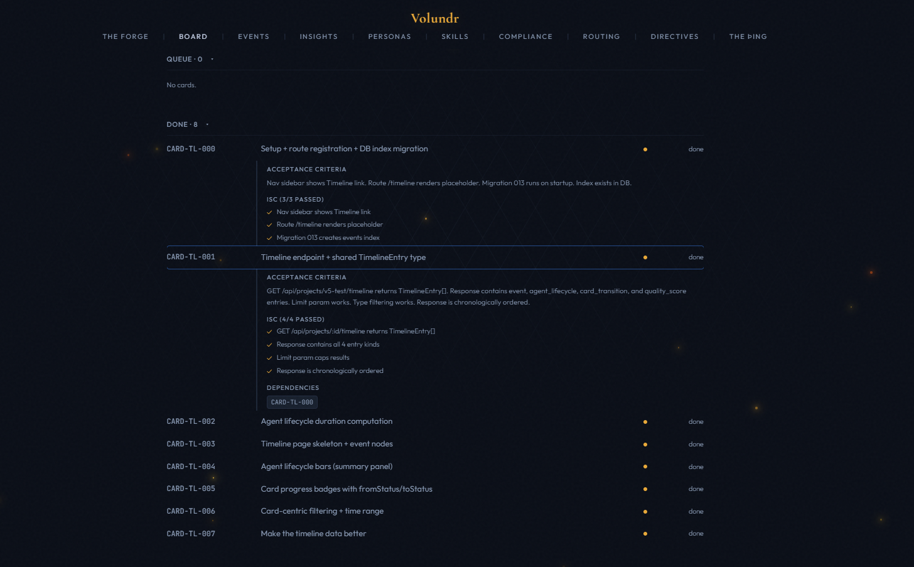
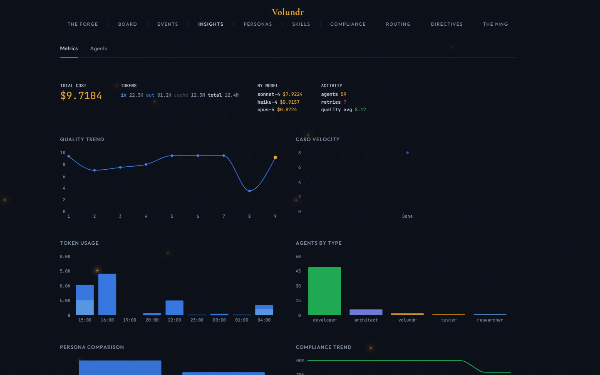
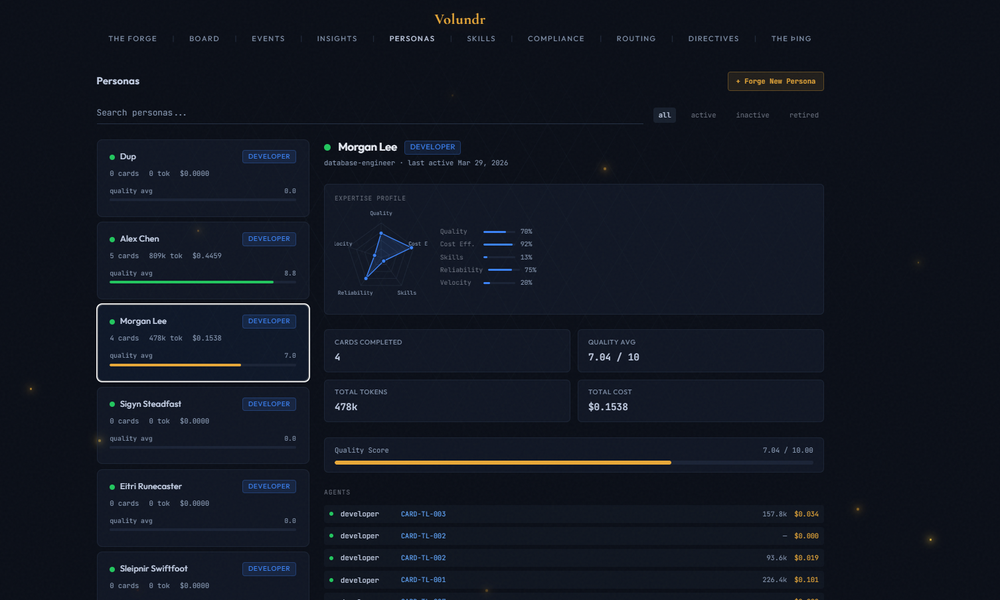

# Volundr

**Autonomous Agent Orchestration for Claude Code**

[](https://github.com/sebwesselhoff/volundr/actions/workflows/ci.yml)
[](LICENSE)
[](https://docs.anthropic.com/en/docs/claude-code)
[](https://nodejs.org)
[](https://www.docker.com)



Volundr is an autonomous PM, architect, and orchestrator that runs inside Claude Code. It manages multi-agent software projects from discovery through deployment — planning work as cards, spawning specialized agent personas, scoring quality with blind reviews, and learning across projects.

> **[Read the Wiki](https://github.com/sebwesselhoff/volundr/wiki)** for full documentation.

---

## Table of Contents

- [Key Features](#key-features)
- [How It Works](#how-it-works)
- [The Persona Roster](#the-persona-roster)
- [Screenshots](#screenshots)
- [Prerequisites](#prerequisites)
- [Installation](#installation)
- [Quick Start](#quick-start)
- [Commands](#commands)
- [Architecture](#architecture)
- [Tech Stack](#tech-stack)
- [Configuration](#configuration)
- [FAQ](#faq)
- [The Name](#the-name)
- [License](#license)

---

## Key Features

- **Autonomous Project Management** — Discovery interviews, blueprint generation, card-based work breakdown with dependency graphs
- **Multi-Agent Orchestration** — Spawns Developer, Architect, QA, DevOps, Designer, Reviewer, and Guardian teammates that work in parallel
- **21 Viking Personas** — Built-in roster of specialists (Baldr Brightblade, Heimdall Watchfire, Mímir Deepwell...) that learn and improve over time
- **Blind Card Reviewer** — Every card gets an independent quality assessment from a separate reviewer agent, not just self-scoring
- **The Forge Dashboard** — Real-time project monitoring with kanban board, agent tracking, quality scores, persona radar charts, and cost metrics
- **Blueprint Debates** — Round Table (stress-test) or Chaos Engine (breakthrough) — AI panel reviews your architecture before implementation
- **Quality System** — 1-10 scoring with blind review, build gates (tsc + production build), steering rules from failures, optimization cycles
- **Three-Tier Persona Discovery** — User-created > pack-installed > built-in roster. Extensible without editing code.
- **Persona Builder** — Create custom personas from the dashboard with expertise tags, traits, and role selection
- **Pack System** — Installable bundles of agent configurations and persona seeds
- **Cross-Project Memory** — Lessons, patterns, and extracted skills persist across projects
- **13 Lifecycle Hooks** — Session start/stop, agent spawn/complete, task completion, worktree management
- **Cost Tracking** — Per-card, per-agent, per-session token usage and dollar cost with budget gating

---

## How It Works

```
Discovery  →  Blueprint  →  Debate  →  Cards  →  Agents  →  Review  →  Ship
   |              |            |          |          |          |          |
 Interview    Architecture   Round     Break       Spawn     Blind      Test,
 5 sections   + plan        Table or  down with   team in   reviewer   document,
                             Chaos    deps + ISC  parallel  scores     retrospect
                             Engine               (personas)
```

1. **Discovery** — Structured interview: vision, stack, design, workflow, anything else
2. **Blueprint** — Architecture plan, then stress-tested by AI debate panel
3. **Persona Discovery** — Matches project stack to specialist personas (mandatory)
4. **Card Breakdown** — Work split into dependency-tracked cards with ISC criteria
5. **Implementation** — Agents spawned with persona charters, work in parallel
6. **Blind Review** — Every card scored by an independent reviewer agent (not self-scored)
7. **Ship** — Integration testing, guardian review, documentation, lessons learned

> **[Full lifecycle details →](https://github.com/sebwesselhoff/volundr/wiki/How-It-Works)**

---

## The Persona Roster

21 Viking-named specialists ship with the framework. Personas accumulate skills and quality stats over time.

| Persona | Role | Domain |
|---------|------|--------|
| Týr Lawbringer | architect | System design, DDD, patterns |
| Heimdall Watchfire | developer | OAuth2, JWT, SSO, MFA |
| Mímir Deepwell | developer | SQL, ORMs, migrations |
| Skuld Threadweaver | developer | ETL, pipelines, data mapping |
| Brokkr Forgehand | devops-engineer | Docker, CI/CD, K8s |
| Saga Storyteller | content | API docs, READMEs |
| Baldr Brightblade | developer | TypeScript, React, Node |
| Víðarr Silentward | reviewer | OWASP, XSS, security audit |
| Forseti Truthseeker | qa-engineer | Jest, Playwright, E2E |
| Iðunn Goldleaf | designer | CSS, design systems |
| Sigyn Steadfast | developer | Python, FastAPI, Django |
| Eitri Runecaster | developer | C#, ASP.NET, Azure |
| Sleipnir Swiftfoot | developer | React Native, Flutter |
| Huginn Thoughtwing | developer | LLM, embeddings, ML |
| Skaði Cloudpiercer | developer | Lambda, serverless, edge |
| Magni Irongrip | reviewer | Profiling, load testing |
| Höðr Allseer | reviewer | WCAG, accessibility |
| Muninn Farseeker | researcher | API research, docs analysis |
| Hermóðr Swiftmessage | developer | REST, GraphQL, gRPC |
| Rán Tidecaller | developer | Schema evolution, migrations |
| Freyja Goldseeker | developer | SEO, structured data |

Create your own via the dashboard's **Persona Builder** or install persona packs.

> **[Full persona docs →](https://github.com/sebwesselhoff/volundr/wiki/Personas)**

---

## Screenshots

| The Forge - Home | Board |
|---|---|
|  |  |

| Insights & Metrics | Personas |
|---|---|
|  |  |

---

## Prerequisites

| Requirement | Version | Notes |
|-------------|---------|-------|
| **Docker** | Any recent | Required for the dashboard container |
| **Claude Code** | Latest | `npm install -g @anthropic-ai/claude-code` |

---

## Quick Start

```bash
git clone https://github.com/sebwesselhoff/volundr.git
cd volundr

# macOS / Linux
./start.sh

# Windows
start.bat
```

The launcher handles everything automatically:
- Starts Docker Desktop if not running
- Initializes `~/.volundr/` on first run
- Pulls and starts the dashboard container
- Waits for the API health check
- Opens The Forge at `http://localhost:3000`
- Launches Claude Code with "Wake up!"

That's it. Volundr activates, checks the dashboard, and starts a discovery interview for your project.

> To start Claude manually instead: `claude` from the volundr directory, then type "Wake up!". Add `--dangerously-skip-permissions` for fully autonomous operation.

> **[Full getting started guide →](https://github.com/sebwesselhoff/volundr/wiki/Getting-Started)**

---

## Commands

| Command | Description |
|---------|-------------|
| `/vldr-shutdown` | Graceful shutdown — saves WIP, session summary, self-review, lessons, checkpoint |
| `/vldr-journal <type> <entry>` | Log a journal entry (decision, insight, blocker, pivot, feedback, milestone) |
| `/vldr-doctor` | Validate setup — checks Docker, dashboard, DB, Git, Node, hooks |
| `/vldr-pack install <name>` | Install an agent pack with persona seeds |

---

## Architecture

```
volundr/                          (this repo)
├── framework/
│   ├── system-instructions.md        Volundr's operating manual
│   ├── packs/                        8 agent packs with persona seeds
│   │   ├── core/                       Baldr, Týr, Hermóðr, Saga
│   │   ├── frontend/                   Iðunn, Höðr, Freyja
│   │   ├── infrastructure/             Brokkr, Skaði, Rán
│   │   ├── security/                   Víðarr, Heimdall
│   │   ├── testing/                    Forseti, Magni
│   │   ├── research/                   Muninn, Skuld, Mímir
│   │   ├── languages/                  Sigyn, Eitri, Sleipnir, Huginn
│   │   └── roundtable/                 Debate voices
│   ├── quality.md                    Scoring rubric + blind reviewer
│   └── agents/                       Registry, traits, team patterns
├── dashboard/                        The Forge (Turborepo monorepo)
│   ├── apps/web/                       Next.js 15 frontend
│   ├── packages/api/                   Express API (:3141)
│   ├── packages/db/                    Drizzle ORM + SQLite
│   ├── packages/sdk/                   TypeScript SDK
│   └── packages/shared/                Types, enums, constants
├── .claude/hooks/                    13 lifecycle hooks
└── start.bat / start.sh              One-click launchers

~/.volundr/                           (user data, private)
├── projects/{id}/                    Blueprint, constraints, reports
├── global/                           Cross-project knowledge
└── data/                             SQLite database
```

> **[Full configuration docs →](https://github.com/sebwesselhoff/volundr/wiki/Configuration)**

---

## Tech Stack

| Layer | Technology |
|-------|-----------|
| **Frontend** | Next.js 15, React 19, Tailwind CSS 4 |
| **API** | Express, WebSocket (ws) |
| **Database** | better-sqlite3, Drizzle ORM |
| **Build** | Turborepo, TypeScript 5.7 |
| **Container** | Docker, pre-built image via [GHCR](https://ghcr.io/sebwesselhoff/volundr-dashboard) |
| **Charts** | Recharts |

---

## Configuration

### Review Gate Levels

| Level | Name | Behavior |
|-------|------|----------|
| 1 | Full Autopilot | Only asks on scope changes |
| 2 | Milestone Review | Pauses at blueprint, first batch, domain completion |
| 3 | Card Review | Shows each card before implementing |
| 4 | Pair Mode | Discusses every decision |

### Persona Discovery

Personas are discovered automatically before implementation. Three-tier priority:
1. **User-created** (dashboard persona builder) — highest
2. **Pack-installed** (via `/vldr-pack install`) — medium
3. **Built-in roster** (21 Vikings) — always available

---

## FAQ

**How much does it cost?**
A small project (5-10 cards) typically runs $2-10. Budget gating pauses before spawning if cost exceeds threshold.

**Is my data shared?**
No. All data stays in `~/.volundr/` on your machine.

**What models does it use?**
Configurable per role. Defaults: Haiku for reviewers/fixers, Sonnet for developers, Opus for Volundr and Guardian.

**Can I add custom agents?**
Yes — create personas via the dashboard builder, or add packs to `framework/packs/`.

> **[Full FAQ →](https://github.com/sebwesselhoff/volundr/wiki/FAQ)**

---

## The Name

**Volundr** (Old Norse: *Völundr*, English: *Wayland the Smith*) is the legendary master craftsman of Norse mythology. An autonomous smith that takes raw materials and forges finished work, orchestrating a team of specialists around the forge.

The dashboard is **The Forge**. The agent assembly is **The Þing** (Old Norse parliament). The 21 built-in personas carry Norse names matching their domains.

---

## License

[MIT](LICENSE) — Sebastian Wesselhoff
