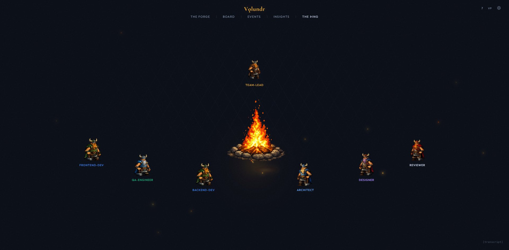
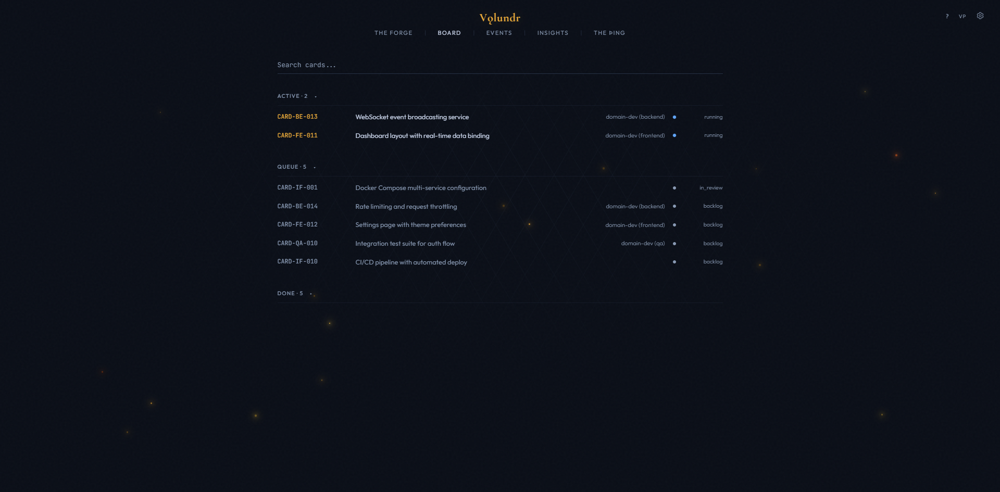

# Vǫlundr

**Autonomous Agent Orchestration for Claude Code**

[](LICENSE)
[](https://docs.anthropic.com/en/docs/claude-code)
[](https://nodejs.org)
[](https://www.docker.com)



Vǫlundr is an autonomous PM, architect, and orchestrator that runs inside Claude Code. It manages multi-agent software projects from discovery through deployment - planning work as cards, spawning specialized agent teammates, scoring quality, and learning across projects.

> **[Read the full documentation](https://sebwesselhoff.github.io/volundr/guide.html)** or open `guide.html` locally in your browser.

---

## Table of Contents

- [Key Features](#key-features)
- [How It Works](#how-it-works)
- [Screenshots](#screenshots)
- [Prerequisites](#prerequisites)
- [Installation](#installation)
- [Quick Start](#quick-start)
- [Commands](#commands)
- [Architecture](#architecture)
- [Agent Types](#agent-types)
- [Tech Stack](#tech-stack)
- [Configuration](#configuration)
- [FAQ](#faq)
- [The Name](#the-name)
- [License](#license)

---

## Key Features

- **Autonomous Project Management** - Discovery interviews, blueprint generation, card-based work breakdown with dependency graphs
- **Multi-Agent Orchestration** - Spawns Developer, Architect, QA, DevOps, Designer, Reviewer, and Guardian teammates that work in parallel
- **The Forge Dashboard** - Real-time project monitoring with kanban board, agent tracking, quality scores, and cost metrics
- **The Campfire** - Live visualization of agent activity around an animated campfire with pixel-art Viking sprites
- **Quality System** - 4-dimension scoring rubric, build gates, retry logic, and steering rules that learn from failures
- **Cross-Project Memory** - Lessons, patterns, and insights persist across projects via a global knowledge base
- **13 Lifecycle Hooks** - Session start/stop, agent spawn/complete, task completion, worktree management, context compaction
- **4 Slash Commands** - `/vldr-shutdown`, `/vldr-journal`, `/vldr-status`, `/vldr-compact`
- **Blueprint Round Table** - AI panel debate reviews your architecture before implementation begins
- **Cost Tracking** - Per-card, per-agent, per-session token usage and dollar cost with budget gating

---

## How It Works

```
Discovery  -->  Blueprint  -->  Cards  -->  Agents  -->  Ship
   |               |              |            |           |
 Interview    Architecture    Break down    Spawn team   Test,
 5-10 Qs      + Round Table   into cards    in parallel  review,
              debate          with deps     (worktrees)  document
```

1. **Discovery** - Vǫlundr interviews you about your project (5-10 targeted questions)
2. **Blueprint** - Generates architecture, runs a round-table debate with virtual perspectives, creates card breakdown
3. **Execution** - Spawns specialized agent teammates in parallel, each in isolated git worktrees
4. **Quality** - Scores every card on 4 dimensions (completeness, code quality, format compliance, independence), retries failures, generates behavioral steering rules
5. **Ship** - Integration testing, architecture guardian review, documentation generation, retrospective

---

## Screenshots

| The Forge - Board | The Campfire |
|---|---|
|  |  |

---

## Prerequisites

| Requirement | Version | Notes |
|-------------|---------|-------|
| **Node.js** | 20+ | Required for the dashboard |
| **Docker** | Any recent | Required for the dashboard container |
| **Claude Code** | Latest | `npm install -g @anthropic-ai/claude-code` |
| **Git** | 2.30+ | Worktree support required |

---

## Installation

### 1. Clone the repository

```bash
git clone https://github.com/sebwesselhoff/volundr.git
cd volundr
```

### 2. Start the dashboard

The launcher script handles everything - Docker container build, database initialization, and health checks.

**macOS / Linux:**
```bash
./start.sh
```

**Windows:**
```bash
start.bat
```

This will:
- Initialize `~/.volundr/` (VLDR_HOME) if it doesn't exist
- Start Docker Desktop if not running
- Build and start the dashboard container
- Wait for the API health check at `http://localhost:3141`
- Open the dashboard at `http://localhost:3000`

### 3. Configure MCP servers (optional)

Copy the example config and add your MCP servers:

```bash
cp .mcp.json.example .mcp.json
```

Edit `.mcp.json` to add any project-specific MCP servers (Playwright is included by default).

---

## Quick Start

```bash
# From the volundr directory:
claude

# Or for fully autonomous mode (no permission prompts):
claude --dangerously-skip-permissions
```

Then type:

```
Wake up!
```

Vǫlundr activates, checks the dashboard connection, and either resumes an existing project or starts a new one with a discovery interview.

---

## Commands

| Command | Description |
|---------|-------------|
| `/vldr-shutdown` | Graceful shutdown - saves WIP, writes session summary, runs self-review, generates lessons, creates checkpoint |
| `/vldr-journal <type> <entry>` | Log a journal entry (types: `decision`, `insight`, `blocker`, `pivot`, `feedback`, `milestone`). No args = show recent entries |
| `/vldr-status` | Quick status dashboard - card progress, running agents, costs |
| `/vldr-compact` | Smart context compaction - preserves project state, cards, teammates, recovery instructions |

### Examples

```
/vldr-journal decision Chose flat hierarchy - only 4 cards
/vldr-journal blocker Migration failing on nullable columns
/vldr-journal insight Build gate must run AFTER npm install
/vldr-status
/vldr-shutdown
```

---

## Architecture

```
volundr/                          (this repo - framework, shareable)
├── framework/
│   ├── system-instructions.md        Vǫlundr's operating manual
│   ├── packs/                        Agent role definitions
│   │   ├── core/                       Developer, Architect, Reviewer, Planner
│   │   ├── frontend/                   Designer
│   │   ├── infrastructure/             DevOps, Content
│   │   ├── quality/                    QA, Guardian, Fixer, Review
│   │   ├── research/                   Researcher
│   │   ├── roundtable/                 Round Table debate voices
│   │   └── testing/                    Tester
│   ├── agents/                       Communication patterns, registry, traits
│   ├── lessons/seed.json             Community lessons (seeded on boot)
│   ├── quality.md                    Scoring rubric and build gates
│   ├── hierarchy-assessor.ts         Auto-select flat vs two-level hierarchy
│   └── shutdown-protocol.md          Graceful shutdown specification
├── dashboard/                        The Forge (Turborepo monorepo)
│   ├── apps/web/                       Next.js 15 frontend
│   ├── packages/api/                   Express API server (:3141)
│   ├── packages/db/                    Drizzle ORM + SQLite
│   ├── packages/sdk/                   Client library for Vǫlundr
│   └── packages/shared/                Shared types and constants
├── .claude/
│   ├── hooks/                        13 lifecycle hooks
│   ├── agents/                       Agent role templates
│   ├── commands/                     Slash commands (shutdown, journal)
│   ├── skills/                       Skills (status, compact)
│   └── settings.json                 Hook configuration
├── start.bat / start.sh              One-click launchers
├── docker-compose.yml                Dashboard container config
├── guide.html                        Comprehensive documentation
└── CLAUDE.md                         Framework entry point

~/.volundr/                           (VLDR_HOME - user data, private)
├── projects/                         Per-project state
│   ├── registry.json                   Project registry
│   └── {project-id}/                   Blueprint, constraints, reports, checkpoints
├── global/                           Cross-project knowledge
│   ├── lessons.md                      Aggregated lessons
│   ├── patterns/                       Reusable patterns from high-scoring cards
│   └── project-history.md              Summary of all completed projects
└── data/                             Dashboard SQLite DB
```

### Data Flow

```
Claude Code  -->  Lifecycle Hooks  -->  Dashboard API  -->  SQLite DB
     |                                      |                    |
     v                                      v                    v
  CLAUDE.md                           WebSocket Push       Next.js Frontend
  (boot instructions)                 (live updates)       (The Forge UI)
```

---

## Agent Types

| Agent | Role | Model Tier |
|-------|------|------------|
| **Vǫlundr** | Team lead - orchestrates everything | Opus |
| **Developer** | Implements features in isolated worktrees (max 4 parallel) | Sonnet |
| **Architect** | Continuous design alignment, pattern enforcement | Sonnet |
| **QA Engineer** | Test strategy, coverage tracking, test execution | Sonnet |
| **DevOps Engineer** | Infrastructure, CI/CD, database migrations | Sonnet |
| **Designer** | UI/UX quality, component patterns, visual consistency | Sonnet |
| **Reviewer** | Cross-domain code review, security checks | Sonnet |
| **Guardian** | Milestone architecture audit, full codebase review | Opus |
| **Researcher** | External API research, documentation analysis | Sonnet |
| **Fixer** | Targeted build-gate fixes (lightweight) | Haiku |

---

## Tech Stack

| Layer | Technology |
|-------|-----------|
| **Frontend** | Next.js 15, React 19, Tailwind CSS 4 |
| **API** | Express, WebSocket (ws) |
| **Database** | better-sqlite3, Drizzle ORM |
| **Build** | Turborepo, TypeScript 5.7 |
| **Container** | Docker, multi-stage build |
| **Visualization** | Custom pixel-art campfire scene |
| **Charts** | Recharts (metrics/insights) |

---

## Configuration

### Review Gate Levels

Set during the discovery interview. Controls how much Vǫlundr pauses for your input.

| Level | Name | Behavior |
|-------|------|----------|
| 1 | Full Autopilot | Only asks on scope changes |
| 2 | Milestone Review | Pauses at blueprint, first batch, domain completion |
| 3 | Card Review | Shows each card before implementing |
| 4 | Pair Mode | Discusses every decision |

### Environment

All user data lives in `VLDR_HOME` (defaults to `~/.volundr/`). Set the `VLDR_HOME` environment variable to change the location. The framework repo contains no user data.

### MCP Servers

Copy `.mcp.json.example` to `.mcp.json` and add your MCP servers. Playwright is included by default.

---

## FAQ

**Does this require a specific Claude plan?**
Works with any Claude Code plan that supports the CLI. No special subscription required.

**How much does it cost to run?**
A small project (5-10 cards) typically runs $2-10. Larger projects scale linearly. Budget gating pauses execution before spawning agents if estimated cost exceeds your threshold.

**What models does it use?**
Configurable per agent role. Defaults: Haiku for fix agents, Sonnet for developers and most roles, Opus for architecture decisions and Guardian reviews.

**Is my project data shared?**
No. All data stays in `~/.volundr/` on your machine. The SQLite database, blueprints, card specs, lessons, and session history never leave your environment.

**What if an agent fails?**
Vǫlundr's quality gate runs after every agent completes. On failure, a Fixer agent retries up to twice. On double failure, the issue escalates to you. Low scores automatically generate behavioral steering rules.

**Can I add custom agents?**
Yes. Add agent packs to `framework/packs/` following the existing pack structure (`pack.json` + `prompts/*.md`).

---

## The Name

**Vǫlundr** (Old Norse: *Völundr*, English: *Wayland the Smith*) is the legendary master craftsman of Norse mythology. A smith of unmatched skill, he could forge anything - weapons, jewelry, machines - working alone in his forge with tireless precision.

When asked what the framework should be called, the AI chose the name itself. An autonomous smith that takes raw materials and forges finished work, orchestrating a team of specialists around a campfire. The name fit.

The dashboard is called **The Forge**. The agent visualization is called **The Þing** (Old Norse assembly). The campfire is where the team gathers.

---

## License

[MIT](LICENSE) - Sebastian Wesselhoff
